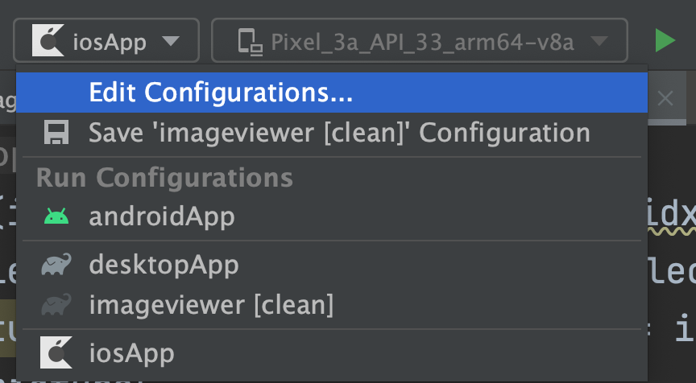

# [Compose Multiplatform](https://github.com/JetBrains/compose-multiplatform) mobile application

This is the [StudyRound](https://studyround.com) mobile [Kotlin Multiplatform](https://kotlinlang.org/docs/multiplatform.html) app that uses the Compose Multiplatform UI framework.


## Set up the environment

> **Warning**
> You need a Mac with macOS to write and run iOS-specific code on simulated or real devices.
> This is an Apple requirement.

To work with this template, you need the following:

* A machine running a recent version of macOS
* [Xcode](https://apps.apple.com/us/app/xcode/id497799835)
* [Android Studio](https://developer.android.com/studio)
* The [Kotlin Multiplatform Mobile plugin](https://plugins.jetbrains.com/plugin/14936-kotlin-multiplatform-mobile)
* The [CocoaPods dependency manager](https://kotlinlang.org/docs/native-cocoapods.html)

### Check your environment

Before you start, use the [KDoctor](https://github.com/Kotlin/kdoctor) tool to ensure that your development environment is configured correctly:

1. Install KDoctor with [Homebrew](https://brew.sh/):

    ```text
    brew install kdoctor
    ```

2. Run KDoctor in your terminal:

    ```text
    kdoctor
    ```

   If everything is set up correctly, you'll see valid output:

   ```text
   Environment diagnose (to see all details, use -v option):
   [✓] Operation System
   [✓] Java
   [✓] Android Studio
   [✓] Xcode
   [✓] Cocoapods
   
   Conclusion:
     ✓ Your system is ready for Kotlin Multiplatform Mobile development!
   ```

Otherwise, KDoctor will highlight which parts of your setup still need to be configured and will suggest a way to fix them.

## Examine the project structure

Open the project in Android Studio and switch the view from **Android** to **Project** to see all the files and targets belonging to the project:


Your Compose Multiplatform project includes 2 modules:

### composeApp

This is a Kotlin module that contains the logic common for both Android and iOS applications, that is, the code you share between platforms.

This `composeApp` module is also where you’ll write your Compose Multiplatform code.
In `composeApp/src/commonMain/kotlin/App.kt`, you can find the shared root `@Composable` function for your app.

It uses Gradle as the build system. You can add dependencies and change settings in `composeApp/build.gradle.kts`.

### iosApp

This is an Xcode project that builds into an iOS application.
It depends on and uses the `composeApp` module as a CocoaPods dependency.

## Run your application

### On Android

To run your application on an Android emulator:

1. Ensure you have an Android virtual device available. Otherwise, [create one](https://developer.android.com/studio/run/managing-avds#createavd).
2. In the list of run configurations, select `composeApp`.
3. Choose your virtual device and click **Run**:

   

<details>
  <summary>Alternatively, use Gradle</summary>

To install an Android application on a real Android device or an emulator, run `./gradlew installDebug` in the terminal.

</details>

### On iOS

#### Running on a simulator

To run your application on an iOS simulator in Android Studio, modify the `iosApp` run configuration:

1. In the list of run configurations, select **Edit Configurations**:

   

2. Navigate to **iOS Application** | **iosApp**.
3. In the **Execution target** list, select your target device. Click **OK**:

   

4. The `iosApp` run configuration is now available. Click **Run** next to your virtual device:

#### Running on a real device

You can run the StudyRound app on a real iOS device for free.
To do so, you'll need the following:

* The `TEAM_ID` associated with your [Apple ID](https://support.apple.com/en-us/HT204316)
* The iOS device registered in Xcode

To run the application, set the `TEAM_ID` in the Configuration files:

1. In the codebase, navigate to the `iosApp/Configuration/` folder.
2. Ask @mofeejegi for the iOS configuration files.
3. Re-open the project in Android Studio. It should show the registered iOS device in the `iosApp` run configuration.

## How to configure the iOS application

To get a better understanding of this template's setup and learn how to configure the basic properties of your iOS app without Xcode,
open the `iosApp/Configuration/Config.xcconfig` file in Android Studio. The configuration file contains:

* `APP_NAME`, a target executable and an application bundle name.
* `BUNDLE_ID`, which [uniquely identifies the app throughout the system](https://developer.apple.com/documentation/bundleresources/information_property_list/cfbundleidentifier#discussion).
* `TEAM_ID`, [a unique identifier generated by Apple that's assigned to your team](https://developer.apple.com/help/account/manage-your-team/locate-your-team-id/#:~:text=A%20Team%20ID%20is%20a,developer%20in%20App%20Store%20Connect).
* Other Secrets and IDs...

To configure the `APP_NAME` option, open `Config.xcconfig` in any text editor *before opening* the project in Android Studio, and then set the desired name.

If you need to change this option after you open the project in Android Studio, do the following:

1. Close the project in Android Studio.
2. Run `./cleanup.sh` in your terminal.
3. Change the setting.
4. Open the project in Android Studio again.

To configure advanced settings, use Xcode. After opening the project in Android Studio,
open the `iosApp/iosApp.xcworkspace` file in Xcode and make changes there.
